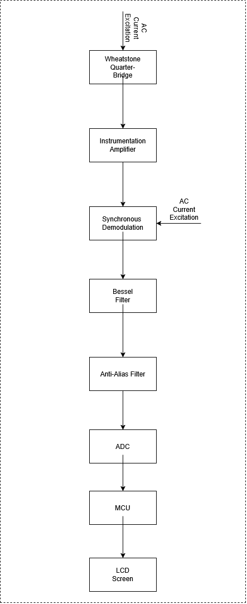
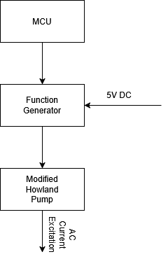

# Overview

Strain gauges produce very small differential voltage signals that encode information about mechanical strain. Precise and accurate measurement requires careful analogue signal conditioning before digitisation, followed by digital signal processing to extract the desired measurement. This project explores the design of a complete measurement device, from sensor excitation and analogue front-end conditioning through to digital acquisition, processing, and display output.

# System Block Diagram

# Key Design Features

## AC Current Excitation
  
Current-driven AC excitation: Current excitation improves the linearity between applied strain and differential bridge output. Using AC rather than DC excitation reduces measurement offset and drift, mitigates low frequency (1/f) noise, and suppresses parasitic thermoelectric effects.
  
## Bessel Filtering
The Bessel response was selected for its absence of overshoot and steeper amplitude roll-off compared with the Butterworth response. The filter also exhibits minimal passband variation and a simulated settling time of 7 ms, which is significantly shorter than the latency introduced by the sigma-delta ADC's digital filtering.

## Oversampled Sigma Delta ADC
Sigma-Delta converters contain integrated features such as digital filters that minimise the effect of extrinsic and intrinsic noise sources such as alias signal noise, 50/60hz power noise, RF noise pick up and clock jitter. The Oversampling nature of Sigma-Delta converts also distributes noise over a wider range of frequencies which reduces the effect of quantisation noise.

# Repository Structure

hardware/ — Contains the schematics, PCB layout files, Gerber files, MCU pin assignment, and hardware revisions.
tr/ — Contains technical research and supporting analysis, including datasheets, application notes, initial problem-space exploration, and SPICE simulations with FFT analysis.
docs/ — Contains the project specification, design documentation, and system diagrams.
firmware/ — Contains the programs running on the MCU for the embedded application.

Logbook entries not available.

# Status
PCB revision in progress; manufacturing pending.
